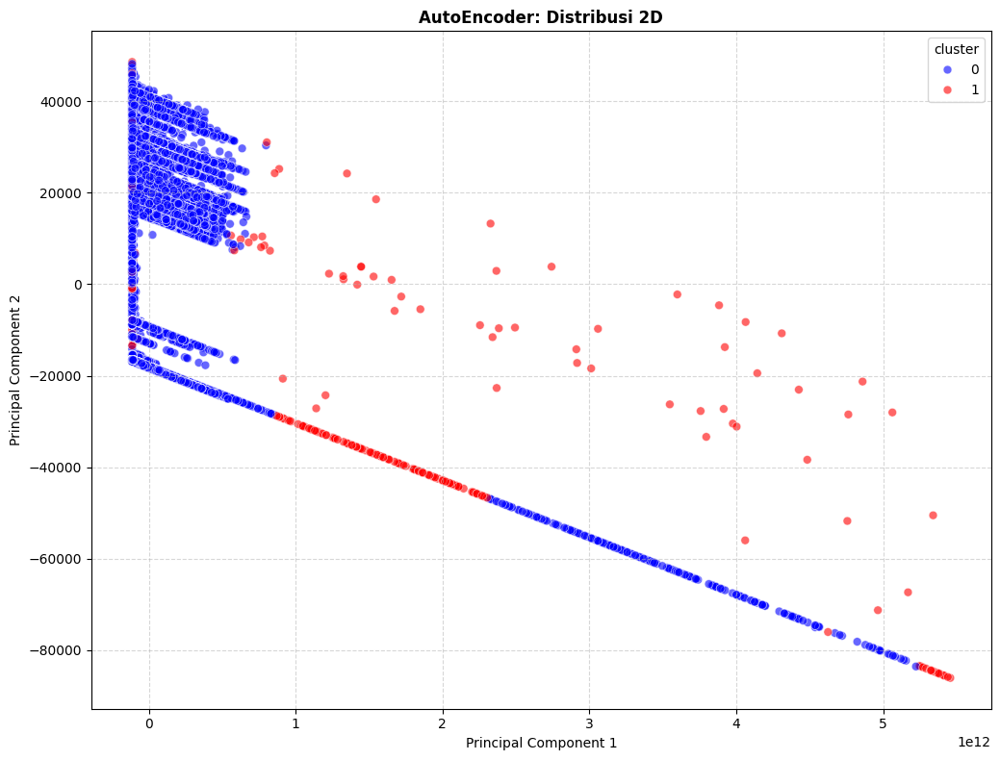
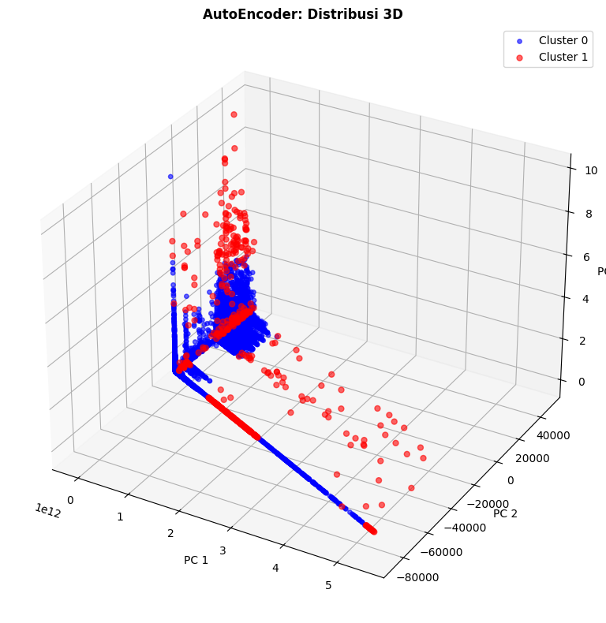

# Clustering Anomaly Traffic IoT Menggunakan AutoEncoder (Deep Learning)

## 📝 Deskripsi Proyek
Proyek ini membangun model unsupervised learning tingkat lanjut menggunakan arsitektur Neural Network (AutoEncoder) untuk mendeteksi anomali (serangan, trafik tidak normal) pada dataset trafik jaringan IoT berskala besar. Model ini dioptimasi secara otomatis menggunakan Keras Tuner (algoritma Hyperband) untuk mencari kombinasi hyperparameter dan bentuk arsitektur yang paling optimal secara data-driven.

Berbeda dengan algoritma klasik yang bergantung pada perhitungan jarak spasial atau isolasi pohon keputusan, pendekatan Deep Learning ini mengedepankan kemampuan jaringan saraf tiruan dalam mempelajari anatomi fundamental dari data normal dan menangkap anomali melalui tingkat kegagalan rekonstruksi (Reconstruction Error).

---

## 📖 Penjelasan Tentang AutoEncoder untuk Deteksi Anomali
AutoEncoder (AE) pada dasaarnya adalah neural network yang dilatih untuk meniru (mencetak ulang) data inputnya sendiri. Jaringan ini terdiri dari dua bagian utama: Encoder (mengkompresi data ke dalam representasi laten) dan Decoder (membangun ulang data dari representasi tersebut).

Untuk kasus *CyberSecurity*, AutoEncoder beroperasi dengan filosofi "Mengingat dan Merekonstruksi":
1. Fase Belajar: Model mayoritas menelan jutaan data normal, sehingga otaknya sangat ahli dalam mengenali dan mencetak ulang pola trafik normal.
2. Fase Deteksi: Ketika model disodori paket data anomali, model akan kebingungan. Kegagalan model dalam mencetak ulang data ini menghasilkan selisih nilai yang besar antara input asli dan output prediksi. Selisih kuadrat inilah yang disebut Mean Squared Error (MSE)/Reconstruction Error.
3. Jika nilai MSE melewati ambang batas (threshold) tertentu, data tersebut divonis sebagai Anomali.

Berikut adalah kelebihan AutoEncoder:
| Kelebihan | Keterangan |
|---|---|
| Mampu menangkap pola non-linear | Berkat hidden layers dan fungsi aktivasi non-linear, model mampu memahami interaksi antar-fitur yang sangat rumit yang luput dari model klasik |
| Arsitektur dinamis | Dapat dikonfigurasi menjadi Undercomplete (kompresi) atau Overcomplete (ekspansi dimensi) sesuai karakteristik dataset |
| Presisi Threshold Matematis | Pemisahan normal dan anomali tidak berbasis tebakan buta, melainkan dari pemotongan kurva distribusi error (misal:persentil ke-99) |

Berikut adalah kelemahan AutoEncoder:
| Kelemahan | Keterangan |
|---|---|
| Engineering Effort Tinggi | Membutuhkan pengaturan arsitektur yang kompleks (jumlah layer, neuron, aktivasi, learning rate) dan rentan terhadap exploding/vanishing gradient |
| Komputasi berat | Proses training (terutama dengan Keras Tuner) memakan waktu lama, memori RAM dan idealnya membutuhkan akselerasi GPU. |

---

## 🚀 Fitur Utama

### 1. Arsitektur Overcomplete
- Berdasarkan hasil pencarian Keras Tuner, arsitektur terbaik yang ditemukan justru memperbesar dimensi data (Overcomplete), bukan mengompresinya:
 - Input: 7 Fitur
 - Layer 1 (Encoder) : 112 Unit (Aktivasi dinamis dari Keras Tuner)
 - Layer 2 (Bottleneck): 60 Unit
 - Layer 3 (Decoder): 112 Unit
 - Output: 7 Unit (Aktivasi Linear, untuk menjaga rentang asli data dari StandardScaler)
 Ekspansi ke 112 dimensi terbukti memberikan ruang bagi jaringan untuk mengurai interaksi non-linear fitur trafik jaringan dengan val_loss sangat rendah (0.04)

### 2. Hyperparameter Tuning & Training Control
- Keras Tuner (Hyperband): Digunakan untuk menyeleksi 80 kombinasi arsitektur dan iterasi secara otomatis untuk menemukan jumlah hidden layer, learning rate (Adam Optimizer) dan fungsi aktivasi terbaik.
- Early Stopping: Pelatihan dikontrol ketat menggunakan patience=5 dengan pengembalian bobot terbaik (restore_best_weights=True), mencegah model menghafal buta (overfitting)sekaligus mengamankan proses dari lonjakan error (exploding gradient).

### 3. Ekstraksi Threshold Deteministik
Batas keputusan (Decision Boundary) tidak ditebak, melainkan dihitung pasti dengan memotong distribusi MSE pada Persentil ke-99. Kalkulasi ini menghasilkan angka threshold absolut sebesar 0.2948 di mana setiap trafik dengan MSE > 0.2948 divonis sebagai anomali.
---

## 📈 Hasil Kinerja & Analisis Kritis Metrik

Distribusi hasil prediksi AutoEncoder pada dataset:
- Cluster 0 (Normal) : 990.000 baris (99%)
- Cluster 1 (Anomali) : 10.000 baris (1%)

Evaluasi Metrik Spasial:
| Metrik | Nilai |
|---|---|
| **Silhouette Score** | 0.8401 | 
| **Davies-Bouldin Score** | 1.4497 |
| **Calinski-Harabasz Score** | 3877.3609 |

🔍 Mengapa nilai metrik sangat spektakuler dibandingkan Isolation Forest? Pada Isolation Forest, Silhouette Score hanya menyentuh 0.13 karena anomali menyebar secara liar. Namun, AutoEncoder mencetak 0.8401 (kategori pemisahan super padat). Mengapa hal ini terjadi?
1. Pemotonga Berbasis Error, Bukan Jarak: AutoEncoder tidak mencoba membentuk bola kepadatan secara geometri sejak awal. Pemisahan dilakukan berdasarkan 1 dimensi absolut yaitu Reconstruction Error.
2. Efekt Threshold yang Tajam: ketika kita memotong data tepat di angka MSE 0.2948, ini menciptakan garis demarkasi yang sangat tegas secara matematis. Titik-titik yang memiliki tingkat kebingungan di atas batas tersebut ditarik keluar secara paksa oleh model, menciptakan separasi yang terlihat sangat sempurna di ruang PCA.
3. Konklusi Metrik: Skor Calinski-Harabasz yang melonjak hingga 3877 membuktikan bahwa kepadatan trafik normal berhasil dirangkum secara sempurna oleh Reconstruction Error yang kecil (0.04), sementara anomalinya terlempar sangat jauh melewati batas threshold.

---

## 📊 Visualisasi Data

Teknik reduksi dimensi Principal Component Analysis (PCA) digunakan untuk memampatkan data ke 2 dan ke 3 dimensi dengan tingkat retensi informasi sangat luar biasa (100%). PCA adalah teknik reduksi dimensi yang mengubah data berdimensi tinggi menjadi beberapa komponen baru yang saling ortogonal, menyimpan variasi paling besar dan menempatkan informasi tanpa kehilangan struktur penting. Menakjubkannya, ekstraksi 3 Principal Components pada model ini berhasil mempertahankan 100% informasi asli, memastikan tidak ada distorsi visual dari arsitektur ruang fitur.

### 1. PCA 2D Clustering
<br>
- Kepadatan trafik normal (titik biru, cluster 0) membentuk garis lurus miring yang sangat tebal dan rapat menjuntai dari pojok kiri atas hingga kanan bawah.
- Berbeda dengan model klasik yang pemisahannya acak, AutoEncoder memotong data dengan garis lurus yang sangat tegas dan rapi (clear cut-off boundary)
- Seluruh titik anomali (merah, cluster 1) berada di area terluar dari potongan tersebut, menyebar jauh dari batas kepadatan biru dengan formasi yang jelas terisolasi.
-Visualisasi ini adalah bukti visual mengapa Silhouette Score bisa mencapai 0.8401; batas threshold 0.2948 berhasil mengiris ruang dimensi fitur menjadi dua zona yang terpisah secara ekstrem tanpa adanya titik yang tumpang tindih (overlapping) di area perbatasan.

### 2. PCA 3D Clustering
<br>
- Penambahan dimensi ketiga memperlihatkan struktur topologi data secara utuh, di mana trafik normal (biru) terpusat pada informasi sudut L (L -shape) yang mengendap di dasar grafik.
- Anomali (merah) dipisahkan tidak hanya di ujung garis memanjang, tetapi juga mencuat ke atas (sumbu PC3) membentuk pilar-pilar merah yang melayang tinggi menjauhi pusat grativitasi data normal.
- Ekstensi ruang spasial 3D ini membuktikan bahwa arsitektur Overcomplete (ekspansi 112 neuron) memungkingkan jaringan mengenali kedalaman anomali yang mustahil terlihat hanya dari perspektif 2 dimensi murni.

### 3. Distribusi 'pkrate' berdasarkan cluster
<br>
- Distribusi trafik normal (kotak biru) memiliki varians yang lebih sempit (IQR padat) dengan median di sekitar nilai 0.00012 yang mengindikasikan kelajuan pengiriman paket harian bersifat repetitif dan stabil.
- Distribusi anomali (kotak merah) posisinya bergeser secara signifikan ke atas dengan median menembus 0.000022.
- Badan kotak merah (IQR) jauh lebih tebal/panjang, mencerminkan bahwa variasi kecepatan paket pada saat terjadi serangan (anomali) sangat berfluktuasi, tidak stabil dan melaju jauh lebih cepat daripada batas normal.
- Hal ini membuktikan bahwa Reconstruction Error tinggi yang ditangkap AutoEncoder sangat berkorelasi dengan aktivitas penyimpangan fitur objektif di dunia nyata.

---

## 🛠 Cara Menggunakan Model

### 1. Prasyarat
Install pustaka berikut:
```bash
pip install pandas numpy scikit-learn joblib tensorflow keras-tuner
```

### 2. Muat dan Gunakan Model
```bash
import pandas as pd
import numpy as np
import joblib
from tensorflow.keras.models import load_model
from sklearn.preprocessing import StandardScaler

# Load Data Mentah Baru
data_baru = pd.read_csv("New_Traffic_IoT.csv")

# Buat Scaler dan fit ke data baru
scaler = StandardScaler()
X_scaled = scaler.transform(data_baru) # Pastikan data sudah bersih sebelum di fit

# Muat pipeline + model
autoencoder = load_model("AutoEncoder_Anomaly_Detection.keras")

# Definisikan Threshold Anomali (Telah dihitung: Persentil 00)
THRESHOLD = 0.2948

# Lakukan Prediksi (Rekonstruksi)
X_baru_pred = autoencoder.predict(X_scaled, batch_size=1024)

# Hitung Reconstruction Error (MSE)
mse = np.mean(np.power(X_scaled - X_baru_pred, 2), axis=1)

# Deteksi Anomali
# Jika MSE lebih besar dari 0.2948, maka Anomali (1)
data_baru['Is_Anomaly'] = np.where(mse > THRESHOLD, 1,0)

print('Hasil Deteksi Trafik Baru Menggunakan AutoEncoder:')
print(data_baru['Is_Anomaly'].value_counts())

```