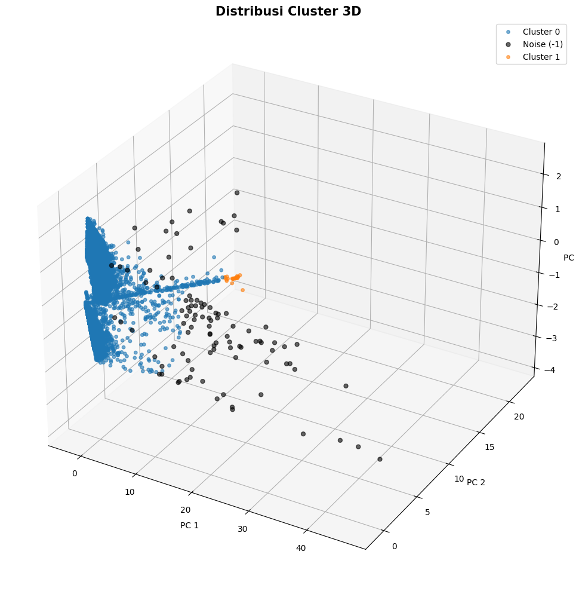

# Clustering Anomaly Traffic IoT Menggunakan DBSCAN

## 📝 Deskripsi Proyek
Proyek ini membangun model *unsupervised learning* **Machine Learning** untuk menemukan pola, struktur, dan hubungan tersembunyi dalam dataset *anomaly traffic IoT*. Model dikembangkan menggunakan pendekatan berbasis kepadatan spasial (*density-based*) dengan **DBSCAN** (*Density-Based Spatial Clustering of Applications with Noise*) sebagai model utama. Berbeda dengan algoritma partisi tradisional, DBSCAN membiarkan data membentuk kelompok alaminya sendiri dan secara otomatis mengisolasi anomali ekstrem sebagai *noise*.

Untuk meningkatkan performa model pada fitur-fitur yang memiliki skala berbeda, data distandarisasi menggunakan *StandardScaler*. Standarisasi mengubah data sedemikian rupa sehingga seluruh fitur memiliki distribusi dengan rata-rata 0 dan standar deviasi 1, memastikan algoritma pengukur jarak beroperasi secara adil tanpa didominasi oleh fitur bernilai raksasa.

---

## 📖 Penjelasan Tentang DBSCAN
DBSCAN adalah algoritma *unsupervised learning* berbasis kepadatan (*density*) yang dirancang untuk menemukan *cluster* dengan bentuk sembarang dan mengidentifikasi *outlier* (pencilan) di dalam data spasial. 

DBSCAN mengelompokkan titik-titik data yang saling berdekatan dan padat, sambil menandai titik-titik yang berada di daerah renggang (kepadatan rendah) sebagai *Noise* atau anomali. Pendekatan ini sangat ideal untuk deteksi serangan siber (seperti DDoS) karena lalu lintas serangan biasanya sangat padat dan seragam, sementara anomali acak terlempar keluar dari kumpulan.

DBSCAN bekerja berdasarkan dua parameter utama:
1. **`eps` (Epsilon):** Radius jangkauan maksimal dari sebuah titik data untuk mencari tetangganya.
2. **`min_samples`:** Jumlah minimum titik data yang harus ada di dalam radius `eps` agar sekumpulan titik tersebut dapat diakui sebagai sebuah *cluster* inti (*core point*).

Secara matematis dan algoritmik, DBSCAN membagi titik-titik menjadi tiga jenis:
- **Core Point:** Titik yang memiliki minimal `min_samples` tetangga di dalam radius `eps`.
- **Border Point:** Titik yang jumlah tetangganya kurang dari `min_samples`, tetapi masih berada di dalam radius `eps` dari sebuah *Core Point*.
- **Noise (Anomali):** Titik yang tidak memenuhi kedua syarat di atas. Titik ini akan diberi label `-1`.

Berikut adalah kelebihan DBSCAN:
| Kelebihan | Keterangan |
|---|---|
| **Tidak Perlu Menentukan K** | DBSCAN tidak memaksa pengguna menebak jumlah *cluster* sejak awal. Model akan menemukan jumlah *cluster* secara organik berdasarkan kepadatan data. |
| **Deteksi Outlier Bawaan** | Otomatis mengisolasi data anomali menjadi kelompok *Noise* (label -1), sangat ideal untuk kasus *Anomaly Detection*. |
| **Bentuk Fleksibel** | Mampu menemukan *cluster* dengan bentuk geometris yang kompleks dan tidak beraturan (non-linear), tidak seperti K-Means yang mengasumsikan bentuk bulat. |

Berikut adalah kelemahan DBSCAN:
| Kelemahan | Keterangan |
|---|---|
| **Sensitif terhadap Parameter** | Sangat bergantung pada pemilihan nilai `eps` dan `min_samples` yang tepat. Pemilihan yang salah dapat menggabungkan semua data atau memecahnya menjadi terlalu banyak *cluster*. |
| **Kepadatan yang Berbeda-beda** | Kesulitan memetakan dataset yang memiliki *cluster* dengan tingkat kepadatan yang bervariasi secara ekstrem. |
| **Kendala Komputasi (Memori)** | Pada data yang sangat masif, pembuatan matriks jarak spasial membutuhkan alokasi RAM yang sangat besar. |

---

## 🚀 Fitur Utama

### 1. Preprocessing Fitur
- Preprocessing dilakukan secara ketat pada tahap awal untuk memastikan kualitas data jaringan.
- Penghapusan nilai negatif pada kolom waktu/durasi (`dt`, `dur`, `tot_dur`). Nilai waktu negatif tidak valid secara logis dalam aliran paket data dan harus dihapus sebelum pemodelan.
- Penerapan *StandardScaler* agar fitur-fitur seperti *throughput* (`tot_kbps`) dan *packet rate* (`pktrate`) memiliki skala yang seimbang saat algoritma menghitung jarak radius Epsilon.

### 2. Building Model DBSCAN
Membangun model DBSCAN memerlukan eksperimen empiris untuk menemukan kepadatan terbaik. Berdasarkan hasil iterasi evaluasi, model final diinisialisasi dengan parameter berikut:
1. **`eps` = 1.5**
   - Jangkauan radius ditetapkan sejauh 1.5 standar deviasi. Nilai ini terbukti optimal (secara makro) untuk menyatukan lautan paket data *botnet* yang padat menjadi satu entitas, tanpa menyedot *noise* di sekitarnya.
2. **`min_samples` = 20**
   - Syarat minimal titik untuk membentuk kepadatan. Ditingkatkan dari standar teoritis untuk memastikan bahwa hanya lalu lintas jaringan yang benar-benar padat dan konsisten yang diakui sebagai *cluster* utama.
3. **`n_jobs` = -1**
   - Memaksa algoritma menggunakan seluruh inti prosesor (CPU *cores*) yang tersedia untuk mempercepat komputasi kalkulasi matriks jarak.

**Parameter Penting pada DBSCAN**
| Parameter | Fungsi | Dampak |
|---|---|---|
| `eps` | Radius maksimal ketetanggaan | Semakin besar, semakin banyak titik bergabung jadi 1 *cluster*. Semakin kecil, *cluster* terpecah jadi banyak bagian. |
| `min_samples` | Syarat kepadatan minimal | Semakin besar nilainya, algoritma semakin "ketat" sehingga banyak data berpotensi terbuang menjadi *Noise*. |
| `metric` | Metrik perhitungan jarak | Default `euclidean`. Menentukan cara model mengukur jarak antar paket data. |
| `n_jobs` | Penggunaan prosesor | `-1` untuk eksekusi paralel tercepat. |

---

## 📈 Hasil Kinerja (Data Eksperimen)

Performa *clustering* dievaluasi secara objektif menggunakan tiga metrik jarak spasial. Evaluasi dilakukan secara eksklusif pada *cluster* yang terbentuk (mengabaikan titik *Noise*) untuk menilai seberapa solid batas pemisahan antar kelompok trafik.

| Metrik | Nilai |
|---|---|
| **Silhouette Score** | 0.8937 | 
| **Davies-Bouldin Score** | 0.1072 |
| **Calinski-Harabasz Score** | 2391.1886 |

**Interpretasi Angka**
1. **Silhouette Score = 0.8937**
   - Skor ini sangat mendekati sempurna (batas maksimal adalah 1.0). Ini mengindikasikan bahwa setiap objek data berada persis di tengah-tengah *cluster*-nya sendiri dan terpisah oleh jarak spasial yang luar biasa jauh dari *cluster* lain.
   - Pada konteks *network flow*, skor ini membuktikan bahwa perilaku antar *cluster* (misal: serangan DDoS vs Trafik Lain) memiliki karakteristik variansi yang sangat bertolak belakang.

2. **Davies-Bouldin Score (DBI) = 0.1072**
   - Semakin mendekati nol, semakin baik. Angka 0.1072 adalah skor yang sangat rendah dan fantastis.
   - Hal ini mencerminkan nyaris tidak ada tumpang tindih (*overlap*) antara *cluster* yang terbentuk. Masing-masing kelompok memiliki kepadatan internal yang solid tanpa berdesakan dengan wilayah tetangganya.

3. **Calinski-Harabasz Score = 2391.1886**
   - Rasio penyebaran data antar-*cluster* berbanding dalam-*cluster*. Angka ribuan yang tinggi ini menegaskan bahwa model sukses besar dalam memaksimalkan jarak pemisah antar benua kelompok data.

---

## 📊 Visualisasi Data

Karena dataset memiliki 7 fitur asli, model mereduksi dimensi tersebut menggunakan metode kompresi PCA (*Principal Component Analysis*) agar pola *cluster* dapat dilihat oleh mata manusia. **Total informasi (variasi) dari 7 fitur asli yang berhasil dipertahankan oleh 3 Principal Components adalah 87.28%**, yang berarti visualisasi ini sangat akurat mewakili bentuk asli data 7 dimensi.

### 1. PCA 2D Clustering

Pada visualisasi 2D (PC1 vs PC2), terlihat dengan jelas bagaimana DBSCAN membelah data. 
- **Cluster 0 (Merah):** Membentuk struktur masif berbentuk huruf "L" yang merepresentasikan mayoritas lalu lintas paket data.
- **Cluster 1 (Hijau):** Terisolasi dengan sangat padat di ujung atas sumbu Y (Principal Component 2), terpisah secara tegas dari kelompok merah. Kepadatan ekstrem ini menjadi penyebab utama Silhouette Score menyentuh angka 0.89.
- **Noise -1 (Biru):** Titik-titik anomali berhasil disaring oleh model dan tersebar renggang di area pinggiran atau di wilayah perbatasan antar *cluster*. 

### 2. PCA 3D Clustering

Menggunakan 3 komponen utama, persebaran data spasial menjadi semakin informatif.
- **Cluster 0 (Biru):** Membentuk dinding kepadatan (*density wall*) yang sangat solid di salah satu sisi ruang dimensi.
- **Cluster 1 (Oranye):** Muncul sebagai gugusan padat yang jauh berjarak dari dinding utama, mengonfirmasi tidak adanya tumpang tindih (sesuai dengan skor Davies-Bouldin 0.1072).
- **Noise -1 (Hitam):** Terlihat mengambang bebas dan menyebar luas di dalam ruang kosong 3 dimensi. Titik-titik hitam inilah yang bertindak sebagai pencilan murni (*outlier*) jaringan yang sukses diisolasi oleh DBSCAN tanpa merusak keutuhan *cluster* utama.

---

## 🛠 Cara Menggunakan Model

Karena DBSCAN berfokus pada topologi lokal, algoritma ini tidak memiliki metode `.predict()` bawaan untuk memproses data baru satu per satu seperti K-Means. Untuk mendeteksi dataset jaringan baru, data tersebut harus digabungkan dan dijalankan ulang menggunakan `fit_predict`, atau menggunakan model pelengkap seperti *K-Nearest Neighbors (KNN)* untuk memetakan label prediksi.

### 1. Prasyarat
Install pustaka berikut:
```bash
pip install pandas numpy scikit-learn matplotlib seaborn
```

### 2. Muat dan Gunakan Model
```bash
import pandas as pd
from sklearn.preprocessing import StandardScaler
from sklearn.cluster import DBSCAN

# 1. Load Data
df = pd.read_csv("Network_Traffic_IoT.csv")
features = ['dt', 'dur', 'tot_dur', 'pktrate', 'port_no', 'rx_kbps', 'tot_kbps']

# 2. Data Cleaning (Hilangkan nilai waktu negatif)
kolom_waktu = ['dt', 'dur', 'tot_dur']
X_bersih = df[(df[kolom_waktu] >= 0).all(axis=1)][features]

# 3. Standarisasi Fitur
scaler = StandardScaler()
X_scaled = scaler.fit_transform(X_bersih)

# 4. Jalankan DBSCAN
dbscan_model = DBSCAN(eps=1.5, min_samples=20, n_jobs=-1)
label_prediksi = dbscan_model.fit_predict(X_scaled)

# Tambahkan hasil ke dataframe
X_bersih['Cluster_Result'] = label_prediksi

print(f"Jumlah cluster yang terbentuk: {len(set(label_prediksi)) - (1 if -1 in label_prediksi else 0)}")
print(f"Jumlah paket anomali (Noise): {list(label_prediksi).count(-1)}")
```