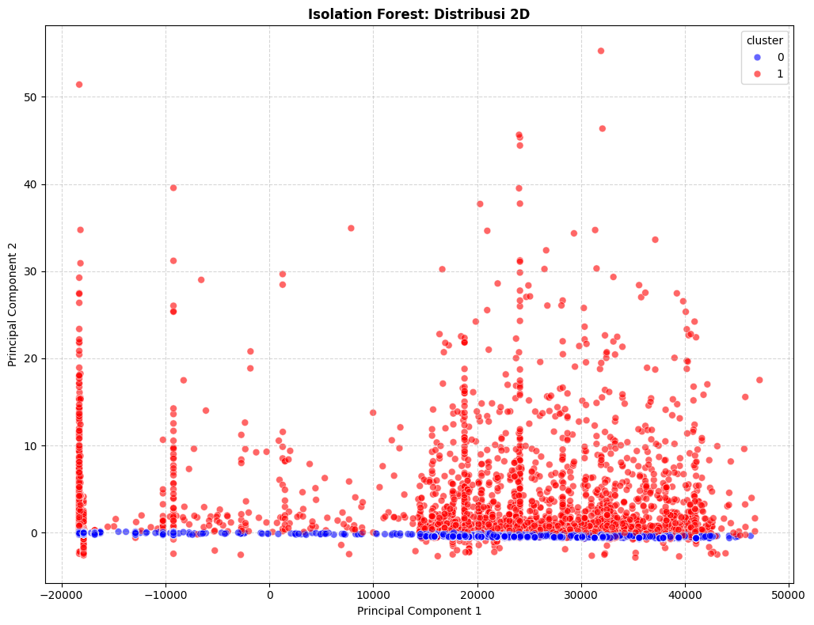
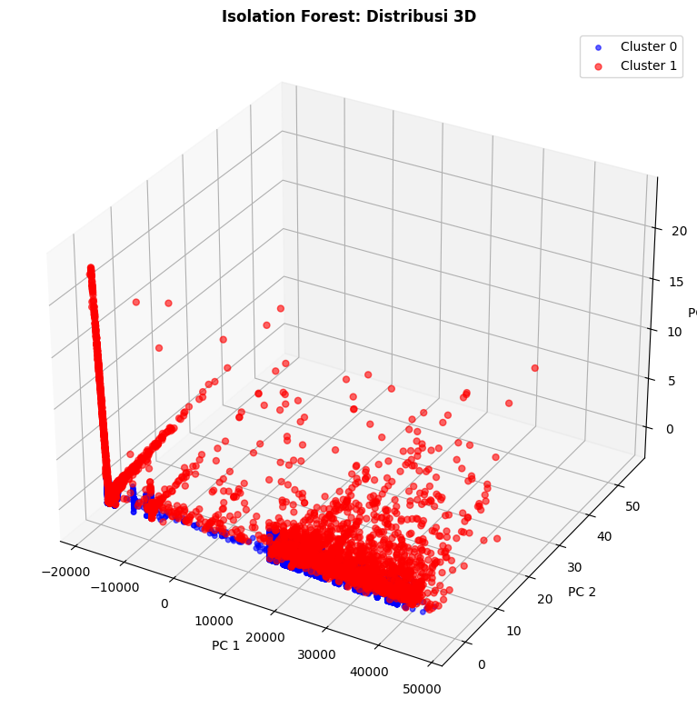

# Clustering Anomaly Traffic IoT Menggunakan Isolation Forest

## 📝 Deskripsi Proyek
Proyek ini membangun model *unsupervised learning* Machine Learning untuk mendeteksi anomali(serangan, traffic tidak normal) pada dataset trafik jaringan IoT berskala besar. Model dikembangkan menggunakan Scikit-Learn Pipeline untuk menjaga kebersihan alur kerja dan mencegah data leakage dengan Isolation Forest sebagai algoritma pendeteksi utama.

Berbeda dengan algoritma clustering tradisional, proyek ini mengedepankan pendekatan *Ensemble Learning* berbasis pohon keputusan. Data fitur numerik direntang dan distandarisasi menggunakan StandardScaler untuk memastikan skala fitur tidak mendistorsi ruang vektor, dengan properti rata-rata 0 dan standar deviasi 1.

---

## 📖 Penjelasan Tentang Isolation Forest
Isolation Forest (iForest) adalah algoritma *unsupervised learning* yang tidak bekerja dengan cara mengelompokkan data normal (clustering) melainkan dengan cara mengisolasi anomali. Algoritma ini sangat ideal untuk kasus CyberSecurity dan FraudDetection.

iForest bekerja didasarkan pada dua karakteristi utama anomali:
1. Minoritas : Jumlahnya jauh lebih sedikit dibandingkan data normal.
2. Atribut berbeda: memiliki nilai fitur yang sangat berbeda atau ekstrem.

Secara matematis dan algoritmik, iForest membangun banyak pohon keputusan acak (random decision tress). Algoritma ini secara acak memililh fitur dan secara acak memilih nilai pemisah (split value) di antara nilai minimum dan maksimum fitur tersebut.
- Data anomali akan terisolasi (terpisah menjadi daun sendiri) dalam sedikit pemotongan (memiliki path length yang pendek).
- Data normal membutuhkan banyak pemotongan untuk bisa dipisahkan karena mereka berkerumumn sangat padat di tengah ruang data (memiliki path length yang panjang).

Berikut adalah kelebihan Isolation Forest:
| Kelebihan | Keterangan |
|---|---|
| Sangat Cepat & Ringan | Memiliki kompleksitas waktu linear dan konstanta memori yang rendah. Mampu menelan jutaan baris data tanpa menyebabkan Out of Memory |
| Tidak menghitung jarak | Bebas dari masalah komputasi jarak matriks (Euclidean) yang berat seperti pada K-Means dan DBSCAN |
| Efektif di Dimensi Tinggi | Tetap stabil meskipun jumlah fitur sangat banyak (Curse of Dimensionality tidak terlalu berdampak) |

Berikut adalah kelemahan Isolation Forest:
| Kelemahan | Keterangan |
|---|---|
| Metrik Evaluasi Bias | Menghasilkan skor evaluasi spasial (seperti silhouette score) yang seolah-olah buruk karena anomali tidak membentuk cluster yang padat |
| Sensitif terhadap sumbu (Axis-Aligned) | Pemotongan pohon dilakukan lurus secara vertikal/horizontal, terkadang kesulitan pada anomali yang berada di ruang diagonal data |

---

## 🚀 Fitur Utama

### 1. Arsitektur Pipeline
- Preprocessing (ColumnTransformer untuk StandardScaler) dan model Isolation Forest dibungkus utuh dalam sebuah Pipeline.
- Menjamin data latih dan data baru (saat deployment) diproses dengan transformasi yang identik, mencegah data leakage.

### 2. Preprocessing Fitur
- Transformasi dilakukan menggunakan ColumnTransformer yang hanya membidik fitur numerik. Sementara fitur lain dapat dilewatkan (passthrough)
- Langkah pembersihan nilai waktu negatif dilakukan sebelum data masuk ke pipeline, karena penghapusan bukanlah operasi transformasi fitur standar, melainkan data cleaning absolut.

### 3. Pembangunan Model Isolation Forest
Membangun model dilakukan dengan mengatur parameter krusial sebagai berikut:
1. n_estimators = 100, membangun 100 pohon keputusan acak. Ini adalah sweet spot antara stabilitas prediksi dan kecepatan komputasi 
2. contamination = 'auto', menginstrusikan model untuk tidak menebak-nebak persentase anomali (misal memaksakan 1% atau 5%). Model akan mencari ambang batas (threshold) skor isolasi secara organik digerakkan oleh data itu sendiri(data-drive)
3. n_jobs = -1, membuka kunci eksekusi pararel penuh. Menggunakan seluruh core CPU untuk memproses jutaan data secara instan.
4. random_state = 42, mengunci seed generator acak agar eksperimen bersifat reproducible (hasilnya selalu konsisten saat dijalankan ulang)
---

## 📈 Hasil Kinerja & Analisis Kritis Metrik

Distribusi hasil prediksi Isolation Forest pada dataset:
- Cluster 0 (Normal) : 924.070 baris (92.4%)
- Cluster 1 (Anomali) : 75.930 baris (7.6%)

Evaluasi Metrik Spasial:
| Metrik | Nilai |
|---|---|
| **Silhouette Score** | 0.1392 | 
| **Davies-Bouldin Score** | 3.2818 |
| **Calinski-Harabasz Score** | 1165.5934 |

🔍 Mengapa nilai Silhouette sangat rendah? (Paradoks Metriks)
Jika mengacu pada standar K-Means, Silhouette 0.13 dan Davies-Bouldin 3.28 adalah angka yang "gagal". Namun, pada Isolation Forest, angka ini sangat wajar dan membuktikan model bekerja dengan benar. Berikut adalah analisisnya:
1. Bentrokan Paradigma (Kohesi vs Isolasi):
    Rumus matematika Silhouette Score memberikan nilai tinggi (mendekati 1) hanya jika anggota dalam satu cluster berkumpul sangat padat seperti bola mampat (kohesi tinggi) dan bola tersebut berjarak sangat jauh dari bola lainnya (separasi tinggi).
2. Karakteristik Anomali yang menyebar (Scattered):
    Isolation Forest mencari "keanehan", bukan kesamaan. Anggota cluster 1 (Anomali) berisi berbagai acam serangan jaringan: ada yang paketnya sangat cepat, ada yang sangat lambat, ada port_scanning, ada DDoS. Karena sifat keanehan ini beragam, titik-titik anomali menyebar secara liar dan berjauhan satu sama lain di pinggiran ruang data.
3. Konklusi Metrik:
    Karena titik anomali (Cluster 1) tidak membentuk satu bola kepadatan yang berdekatan, melainkan menyebar bebas mengelilingi data normal, rumus Silhouette Score menghukumnya dengan nilai 0.1392. Davies-Bouldin yang mengukur sebaran internal juga melonjak ke 3.2818. Ini bukan indikasi kegagalan model, melainkan batas kelayakan (limitation) metrik berbasis jarak untuk mengukur efektivitas model berbasis isolasi.

---

## 📊 Visualisasi Data

Teknik reduksi dimensi Principal Component Analysis (PCA) digunakan untuk memampatkan data ke 2 dan ke 3 dimensi dengan tingkat retensi informasi sangat luar biasa (100%). PCA adalah teknik reduksi dimensi yang mengubah data berdimensi tinggi menjadi beberapa komponen baru yang saling ortogonal, menyimpan variasi paling besar dan menempatkan informasi tanpa kehilangan struktur penting. Pada visualisais 2D, data dikompresi menjadi 2 komponen utama (PC1 dan PC2)

### 1. PCA 2D Clustering
<br>
- Titik-titik biru (Normal) sangat padat, merapat dan bertumpuk membentuk garis lurus horizontal persis di sekitar sumbu Y = 0 pada PC2.
- Persebaran data di dimensi kedua (PC2) hampir tidak ada.
- Ini menandakan bahwa trafik mayoritas (normal) memiliki karakteristik yang sangat seragam, monoton, dan berulang.
- Titik-titik merah (Anomali) menyebar luas menjauhi garis biru normal.
- Banyak titik yang mencuat tinggi secara ekstrem baik secara vertikal di sumbu PC2 maupun secar horizontal di pinggiran PC1.
- Menandakan bahwa data anomali memliki variasi yang sangat tinggi dan bervariasi jenis "keanehannya".
- Visualisasi ini menjawab mengapa skor Silhouette Score pada Isolation Forest sangat rendah. Isolation Forest tidak membagi data dengan cara membentuk dua bola kepadatan yang terpisah seperti K-Means. Ia mendeteksi dan mengisolasi titik-titik penyimpangan esktrem yang menyebar liar ke segala arah di luar garis kepadatan utama. Secara logika cybersecurity ini sangat akurat karena serangan jaringan memang tidak selalu memiliki satu pola yang seragam.

### 2. PCA 3D Clustering
<br>
Sama dengan PCA 2D, namun visualisasi ini menyimpan tiga komponen utama (PC1, PC2, dan PC3). Visualisasi ini sangat membantu untuk dataset kompleks di mana cluster mungkin terlihat tumpang tindih jika hanya diliat dari 2 dimensi.
- Membentuk garis padat tebal yang tertidur rata di dasar ruang 3D yakni cluster 0 (normal). Sangat homogen dan konsisten di satu area spesifik.
- Cluster 1 (anomali) terlihat seperti pilar-pilar atau awan titik merah yang melayang bebas menjauhi dasar biru. Titik merah menempati area-area ruang data yang kosong.
- Penambahan dimensi ketiga semakin mempertegas bahwa anomali jaringan IoT (Cluster 1) ini berwujud pencilan (outliers) ekstrem yang tersebar , bukan sebuah cluster padat yang solid. Isolation Forest berhasil mendeteksi "titik-titik kesepian" di ruang 3D ini dan mengisolasinya sebagai anomali.

### 3. Distribusi 'pkrate' berdasarkan cluster
<br>
Grafik boxplot ini menampilkan distribusi fitur pktrate berdasarkan cluster. Kotak (IQR) menunjukkan persebaran 50% data di tengah, garis di dalamnya adalah median. Whisker adalah batas wajar dan titik-titik di luarnya adalah outlier.
- Kotaknya (IQR) pada cluster 0 (biru) lebih tebal/lebar dibanding cluster 1 (merah), mencakup rentang nilai pktrate dari sekitar 0.00005 hingga hampir 0.00018.
- Median berada di nilai sekitar 0.00012
- Data tersebar secara wajar hingga ujung batas whisker dan tidak ada titik outlier ekstrem yang terlihat di luar whisker.
- Posisi kotak box bergeser pada cluster 1 secara signifikan ke arah atas (rentang 0.00016 - 0.00024) dengan median di atas 0.00020. Ini berarti rata-rata laju paket anomali ini lebih cepat dibanding rata-rata trafik normal.
- Meskipun kotaknya tinggi, terdapat kumpulan titik outlier berwarna hitam tebal persis di bawah garis whisker bawah yang jatuh sangat tajam hingga menyentuh nilai 0.00000.
- Tumpukan titik hitam yang membentuk garis vertikal ke bawah ini adalah kelompok anomali dengan nilai pktrate yang luar biasa lambat.

Grafik ini adalah bukti absolut ketangguhan algoritma pohon (Isolation Forest). Berbeda dengan K-Means, Isolation Forest berhasil menangkap dan mengisolasi anomali dari dua sisi spektrum ekstrem sekaligus. Di satu sisi, ia memisahkan trafik yang laju paketnya tinggi dan di saat yang bersamaan ia juga menebang dan memisahkan trafik yang laju paketnya nyaris nol menjadi cluster anomali (cluster 1).

---

## 🛠 Cara Menggunakan Model

### 1. Prasyarat
Install pustaka berikut:
```bash
pip install pandas numpy scikit-learn matplotlib seaborn joblib
```

### 2. Muat dan Gunakan Model
```bash
import pandas as pd
import numpy as np
import joblib

# 1. Muat pipeline + model
iforest_pipeline = joblib.load("iforest_pipeline_model.pkl")

# 2. Load Data Mentah Baru (Pastikan nama dan urutan kolom sesuai dataset asli)
data_baru = pd.read_csv("New_Traffic_IoT.csv")

# 3. Melakukan Prediksi
# iForest Bawaan mengeluarkan: 1 (Normal), -1 (Anomali)
prediksi_mentah = iforest_pipeline.predict(data_baru)

# 4. Standarisasi Output ke Format Sistem (0 = Normal, 1 = Anomali)
prediksi_final = np.where(prediksi_mentah == 1, 0, 1)
data_baru['Is_Anomaly'] = prediksi_final

print("Hasil Deteksi Trafik Baru:")
print(data_baru['Is_Anomaly'].value_counts())

```